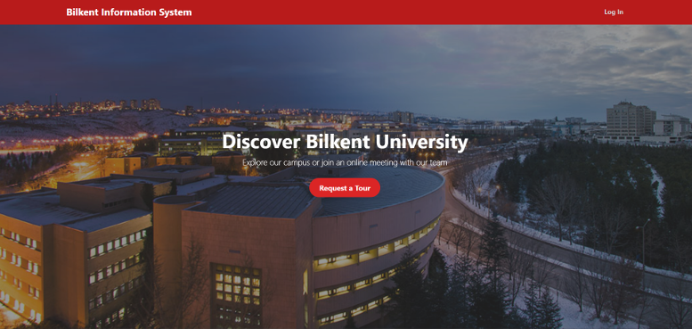
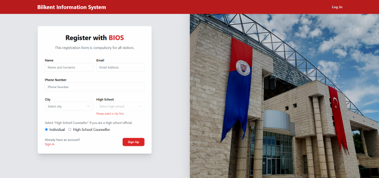
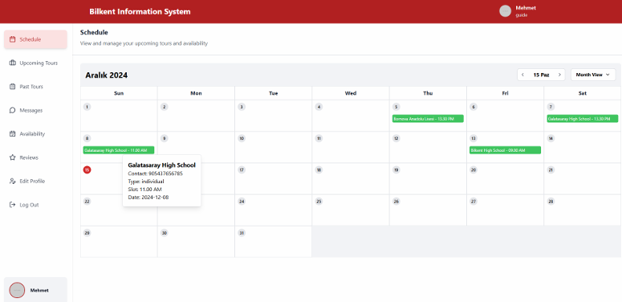
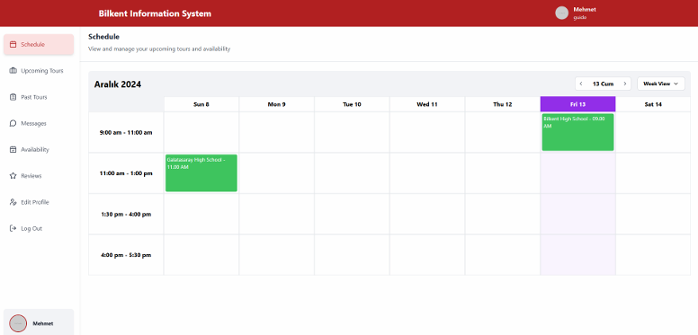
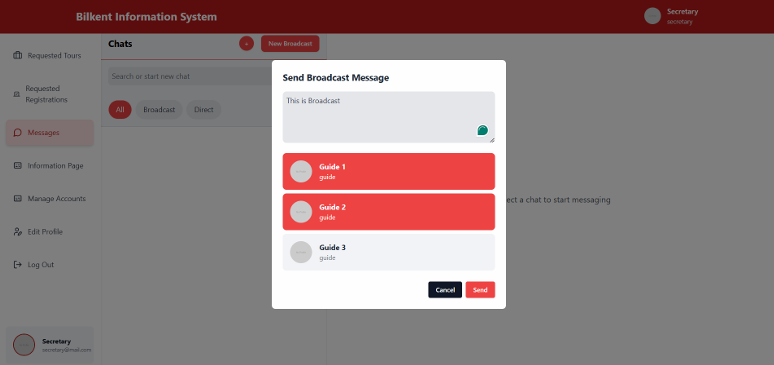
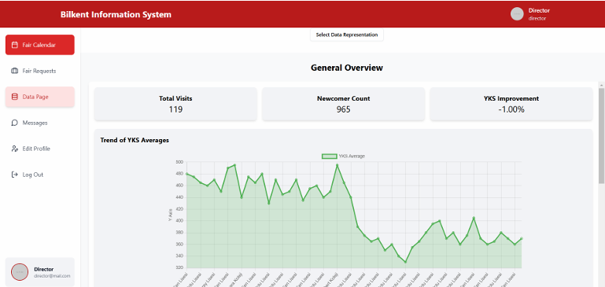

# Bilkent Information Office System (BIOS)



Welcome to the **Bilkent Information Office System (BIOS)**, a robust web application designed to streamline the management of university tours, staff, and guides. The system features role-based authentication, real-time messaging, and data visualization capabilities, making it a comprehensive solution for the Bilkent University Information Office.

---

## Key Features

### 🌟 **User Roles and Management**
- **Role-based Authentication:**
  - Uses **JWT tokens** for secure authentication.
  - Differentiated roles: **Prospective Students**, **High School Representatives**, **Information Office Staff**, and **Guides**.
- **Account Creation:**
  - Prospective students and high schools can sign up and request tours.
  - Staff can manage accounts and assign roles.



### 🗓️ **Tour and Guide Management**
- Students and schools can request campus tours.
- Office staff can:
  - Approve or decline tour requests.
  - Assign guides to specific tours.
- Guides:
  - Get notified about upcoming tours.
  - View their schedules and assigned tours.
  - Track progress and view performance reviews.




### 💬 **Real-Time Messaging**
- Built with **Django Channels** and **WebSockets** for seamless communication.
- Two messaging modes:
  - **Direct Messaging:** One-to-one communication.
  - **Broadcast Messaging:** Notifications for specific user groups.



### 📊 **Data Monitoring and Visualization**
- Data analytics page to monitor:
  - Distribution of scholarships.
  - Tour attendance trends.
  - High school visitation frequency.
  - Heatmap of the schools in Türkiye.
  - Other insightful metrics.
- Interactive charts and graphs for enhanced decision-making.



---

## Tech Stack

### **Frontend**
- **Vue.js:** Modern JavaScript framework for building dynamic user interfaces.
- **Vite.js:** Lightning-fast frontend tooling.
- **Tailwind CSS:** Utility-first CSS framework for rapid UI development.

### **Backend**
- **Django:** High-level Python web framework for rapid development.
- **PostgreSQL:** Reliable and powerful relational database system.
- **Django Channels:** Enables real-time messaging with WebSocket support.

---

## Project Structure

```plaintext
.
├── frontend/        # Vue.js frontend code
├── backend/         # Django backend code
├── assets/          # Images for the README and documentation
└── README.md        # Project documentation
```

---

## Installation and Setup

### Prerequisites
- **Docker**

### Backend Setup
1. Navigate to the `backend` directory:
   ```bash
   cd backend
   ```
2. Build the `backend`:
   ```bash
   docker-compose build
   ```
3. Start the `backend` by running:
   ```bash
   docker-compose up
   ```

### Frontend Setup
1. Navigate to the `frontend` directory:
   ```bash
   cd frontend
   ```
2. Build the `frontend` by running:
   ```bash
   docker-compose build
   ```
3. Start the `frontend` by running:
   ```bash
   docker-compose up
   ```
